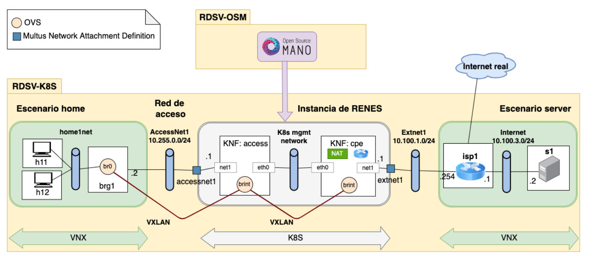
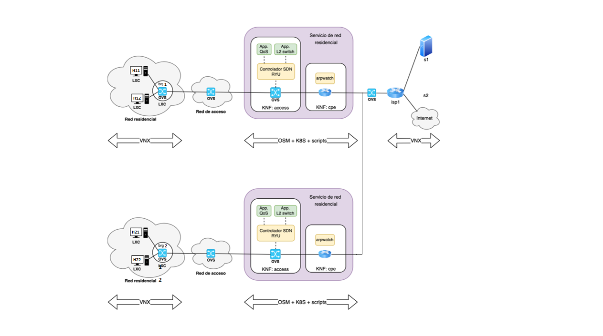

RDSV/SDNV - MUIRST - MUIT

2023

Miguel Ángel Cuesta Bravo, Laura Fernández Galindo & José Javier Mata de la Fuente

# Trabajo Final

## Situación inicial del proyecto <a name="crearvmlocal"></a>

En esta sección se trata de dar una vista general del proyecto, tanto en contenido como en desarrollo. En primer lugar, el servicio de red bajo estudio es el servicio residencial de acceso a Internet, donde el router residencial se sustituye por un “Bridged Residential Gateway (BRG)” que realiza la conmutación de nivel 2 del tráfico de los usuarios entre la red residencial y la central local. El resto de las funciones se realizan en la central local aplicando técnicas de virtualización de red (NFV), creando un servicio de CPE virtual (vCPE) gestionado mediante la plataforma de orquestación.
Para su implementación se ha utilizado la imagen virtual RDSV2022-v1.ova, la cual virtualiza RDSV-K8S, que nos permite utilizar el paquete microk8s, la herramienta VNX, Open vSwitch (ovs); y RDSV-OSM, que instala el entorno OSM, al que se accede gráficamente. En esta primera imagen se mustra el escenario inicialde la práctica sin ningún cambio:




El escenario que se busca desplegar esta formado por dos redes residenciales como las que se muestran en la imagen. Estas presentan una conectividad IPv4 desde cada una de las redes residenciales hacia Internet. Usan doble NAT: en KNF:cpe y en isp1. Como se puede observar, se ha sustituido el switch KNF:access por uno controlado por OpenFlow y se gestionará la calidad de servicio en la red de acceso mediante la API REST de RYU. Además, en el switch de KNF: cpe se ha activado la captura de tráfico ARP mediante arpwatch.


### Instalar los escenarios 
Primero se debe instalar en dos ordenadores distintos con cuentas diferentes instalar los escenarios.

En pc-k8s se ejecuta:
```console
/lab/rdsv/get-osmlab2 RDSV-K8S l060
```

En pc-osm se ejecuta.
```console
/lab/rdsv/get-osmlab2 RDSV-OSM l059
```
<sub> En ambos casos lxx será el identificador de cada ordenador.</sub>

### Despliegue del nuevo escenario 
Para comenzar a desplegar los escenarios se debe clonar el repositorio en ambas máquinas:
```console
git clone https://github.com/prdsv/practica.git
```
Se debe mover a la carpeta del repositorio:
```console
cd practica
```
Se da permisos a permisos.sh y se ejecuta consiguiendo que todos los script descargados tengan los permisos necesarios.
```console
chmod 777 permisos.sh
```
```console
./permisos.sh
```
En RDSV-K8S se procede a deplegar el escenario para ello:
```console
. ./deployk8.sh
```
En RDSV-OSM se podrá desplegar el escenario completo realizando:
```console
cd rdsv-final

. ./deploy.sh
```

Para dar conectividad a la red residencial 1 y poder acceder a sus Ips se realiza.

```console
cd rdsv-final
```
. ./osm_renes1.sh

Para mostrar las ips de los host se realiza:
```console
ifconfig eth1
```
Si fallará el comando se hace:
```console
dhclient eth1
ifconfig
```


Para comprobar que existe conexión a Internet se realiza:
```console
ping 8.8.8.8
```
<sub> Se realiza el mismo proceso para la red residencial segunda pero ejecutando . ./osm_renes2.sh</sub>
### Ryu: controlar la calidad de servicio
## Configuración de la primera red residencial:
Para que la primera red residencial cumpla las condiciones de QoS que son: un límite de 12Mbps de bajada y 6Mbps de subida. Y para los host en el caso de h11 8Mbps de bajada y 4Mbps mínimos de subida y de h12 4Mbps máximos de bajada y 2Mbps máximos de subida, se ejecuta para configurar las condicones de bajada:

```console
. ./renes1qosdown.sh
```
Y para las condiciones de subida:
```console
. ./renes1qosup.sh
```
Para probar que se ha hecho bien la configuración de bajada en los hosts se ejecuta:
```console
iperf3 -s -i 1 -p 5002
```
Para mandar tráfico primero se accede a KNF:cpe y se realiza:
```console
kubectl -n $OSMNS exec -it $CPEPOD -- /bin/bash
iperf3 -c 192.168.255.2x -p 5002 -u -b 20M 1200
```

Para probar que se ha hecho bien la configuración de subida primero se accede a KNF:cpe y se realiza:
```console
kubectl -n $OSMNS exec -it $CPEPOD -- /bin/bash
iperf3 -s -i 1 -p 5002
```
En los hosts se realiza:
```console
iperf3 -c 192.168.255.1 -p 5002 -u -b 20M 1200
```
## Configuración de la segunda red residencial:
Para dar conectividad a la red residencial 2 y poder acceder a sus Ips se realiza:
```console
. ./osm_renes2.sh
```
Para mostrar las ips de los host se realiza:
```console
ifconfig eth1
```
Si fallará el comando se hace:
```console
dhclient eth1
ifconfig
```
Para comprobar que existe conexión a Internet se realiza:
```console
ping 8.8.8.8
```
Por otro lado, para que la segunda red residencial cumpla las condiciones de QoS que son: un límite de 12Mbps de bajada y 6Mbps de subida. Y para los host en el caso de h11 8Mbps de bajada y 4Mbps mínimos de subida y de h12 4Mbps máximos de bajada y 2Mbps máximos de subida, se ejecuta para configurar las condicones de bajada:

```console
. ./renes2qosdown.sh
```
Y para las condiciones de subida:
```console
. ./renes2qosup.sh
```
Se instala iperf en todos los host mediante:
```console
. ./iperf.sh
```
Para probar que se ha hecho bien la configuración de bajada en los host se ejecuta:
```console
iperf3 -s -i 1 -p 5002
```
Para mandar tráfico primero se accede a KNF:cpe y se realiza:
```console
kubectl -n $OSMNS exec -it $CPEPOD2 -- /bin/bash

iperf3 -c 192.168.255.2x -p 5002 -u -b 20M 1200
```
Para probar que se ha hecho bien la configuración de subida primero se accede a KNF:cpe y se realiza:
```console
kubectl -n $OSMNS exec -it $CPEPOD2 -- /bin/bash

iperf3 -s -i 1 -p 5002
```
En los hosts se realiza:
```console
iperf3 -c 192.168.255.1 -p 5002 -u -b 20M 1200
```
## Captura de tráfico ARP mediante “arpwatch”

### Captura de tráfico ARP mediante “arpwatch” en la primera red residencial
Para poder realizar la captura de tráfico ARP mediante arpwatch en la red residencial 1 se debe acceder a KNF:cpe y realizar pings:

```console
kubectl -n $OSMNS exec -it $CPEPOD -- /bin/bash 
```
Y se realiza la captura de tráfico:
```console
. ./arpwatch.sh
```
Y se hacen los pings para rellenar las tablas, por un lado dentro de KNF:cpe para registrar el tráfico de net1:

```console
ping -c5 10.100.1.254
```
Y en h11 o en h12:

```console
ping -c5 192.168.255.2x

#Otra una Ip que no este dentro de la red residencial

ping -c5 192.168.255.30
```
Se para el proceso de captura de tráfico:
```console
/etc/init.d/arpwatch stop
```
Y se observa el tráfico capturado en las interfaces net1 y en brint:
```console
cat net1.dat
cat brint.dat
```
### Captura de tráfico ARP mediante “arpwatch” en la segunda red residencial
Para poder realizar la captura de tráfico ARP mediante arpwatch en la red residencial 2 se debe acceder a KNF:cpe y realizar pings:

```console
kubectl -n $OSMNS exec -it $CPEPOD2 -- /bin/bash 
```
Y se realiza la captura de tráfico:
```console
. ./arpwatch.sh
```
Y se hacen los pings para rellenar las tablas, por un lado dentro de KNF:cpe para registrar el tráfico de net1:

```console
ping -c5 10.100.1.254
```
Y en h21 o en h22:

```console
ping -c5 192.168.255.2x

#Otra una Ip que no este dentro de la red residencial

ping -c5 192.168.255.30
```
Se para el proceso de captura de tráfico:
```console
/etc/init.d/arpwatch stop
```
Y se observa el tráfico capturado en las interfaces net1 y en brint:
```console
cat net1.dat
cat brint.dat
```


